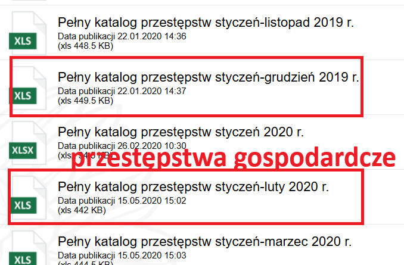
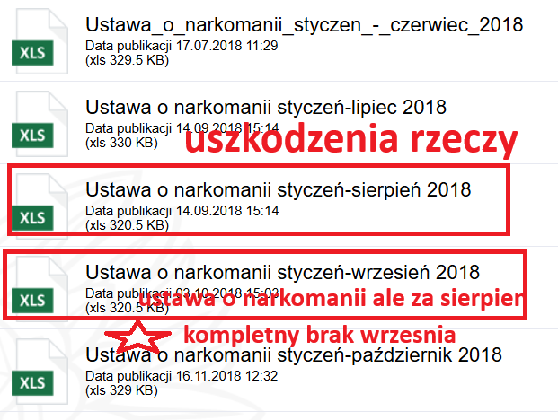
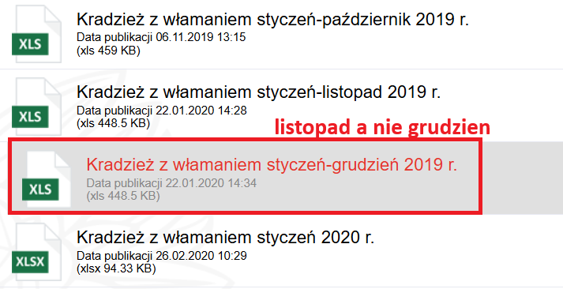
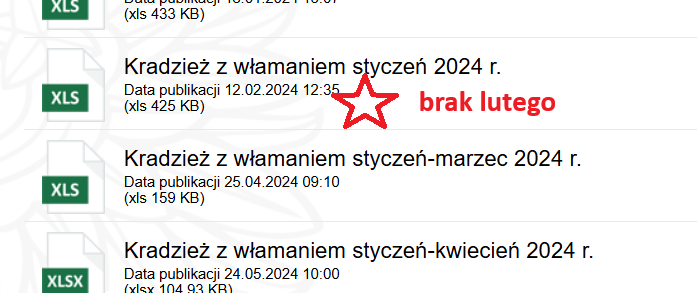
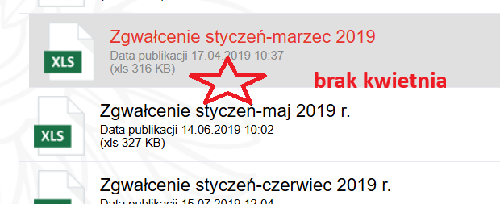
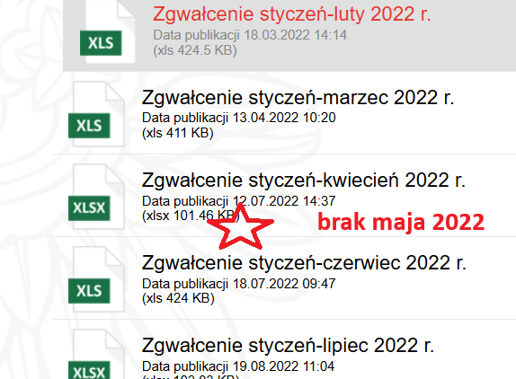

# Install

### Plotly dependencies

```
sudo apt-get install libssl-dev libcurl4-openssl-dev pandoc
```

### Run

```R
source("requirements.R")
source("R/data.R")
```

# Bledy w danych

1. [Pełny katalog przestepstw](https://ksp.bip.policja.gov.pl/ksp/statystyki/27830,Pelny-katalog-przestepstw-garnizon-stoleczny.html):



2. [Bojki i pobicia](https://ksp.bip.policja.gov.pl/ksp/statystyki/27824,Bojka-i-pobicie-garnizon-stoleczny.html)


3. [Ustawa o narkomanii](https://ksp.bip.policja.gov.pl/ksp/statystyki/27836,Ustawa-o-narkomanii-garnizon-stoleczny.html)



4. [Kradziez z wlamaniem](https://ksp.bip.policja.gov.pl/ksp/statystyki/27829,Kradziez-z-wlamaniem-garnizon-stoleczny.html)




5. Zgwalcenia


